### Dweet.io and Freeboard

This repository contains sample code to send data to cloud on freeboard.io and visualize the data in a dashboard on freeboard.io.

Dweet.io is a simple messaging service. Just like you can send a tweet on twitter, you can send a *dweet* from your device to the dweet.io platform.

freeboard.io is a companion website to create a dashboard and customize the layout, use different widgets to visualize the data.


#### Dweeting data

This repository contains two sample codes to demonstrate the use of this service.
1. [send_dummy_dweet.py](send_dummy_dweet.py)

  This file sends a completely dummy random data to dweet.io. This is only for demonstration of how the dweet and freeboard cloud services work. The random data also includes gps co-ordinates to simulate a moving vehicle between two points.

2. [send_sensors_dweet.py](send_sensors_dweet.py)

  This code reads the distance measured by ultrasonic distance sensor HC-SR04 and transmits this data to dweet. You must have a working setup for HCSR04 sensor in accordance with the code in [../../devices/hcsr04.py](../../devices/hcsr04.py)

Follow the steps below to use this cloud service.

###### Step 1

* To create an account on [freeboard.io](http://freeboard.io/). click on the 'START NOW' button.

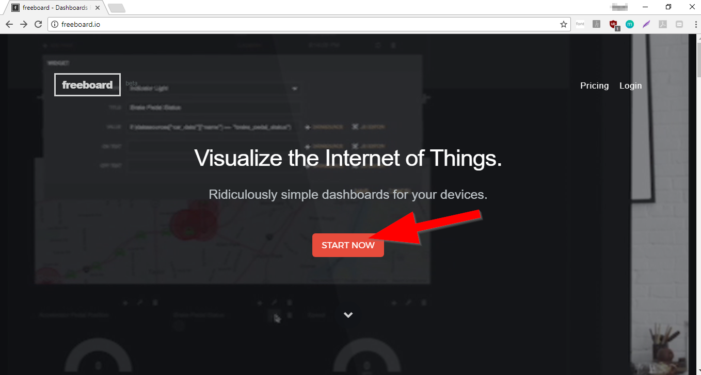

Alternatively, click on [this](https://freeboard.io/signup) link to create your account.

* Provide your email address, password and pick a username for your account.

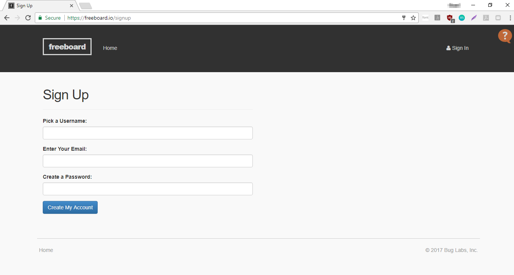


There is no need to create account on dweet.io.

###### Step 2

We will first send some dummy Now get back to the terminal window on your Raspberry Pi. If you would like to directly use the ultrasonic distance sensor data instead, jump to Step 7 below.

Open the file [send_dummy_dweet.py](send_dummy_dweet.py)
Use a unique name for your data and add it within the double quotes on the line:
```
Dweet_Thing_Name = ""
```
To ensure the uniqueness for name of your data (also called as thing), you can use your full name or combination of name, age, date of birth or anything similar.

The line should look something like this:

```
Dweet_Thing_Name = "MY_Unique_Name_Raspi_Dweet_0401"
```

Note that the names are case sensitive.

Save the file.


###### Step 2

Execute the code now.

```
python send_dummy_dweet.py
```

This should output a message indicating the dweet was successful and also a URL. This URL is where you should be able to visualize your data.

```
Dweet successful. Please check https://dweet.io/follow/MY_Unique_Name_Raspi_Dweet_0401
```
###### Step 3

Visit the web page shown by the URL in your terminal. This will show the dummy data such as google map with location and simulating the movement of a vehicle between two locations.

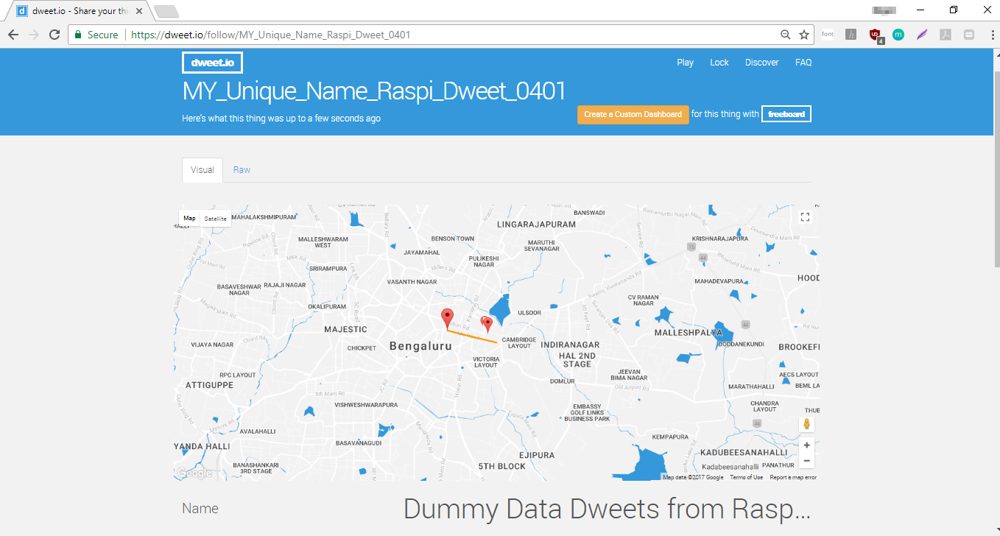

Scrolling down this web page you should also be able to see other random data with a line chart simulating the data changes.

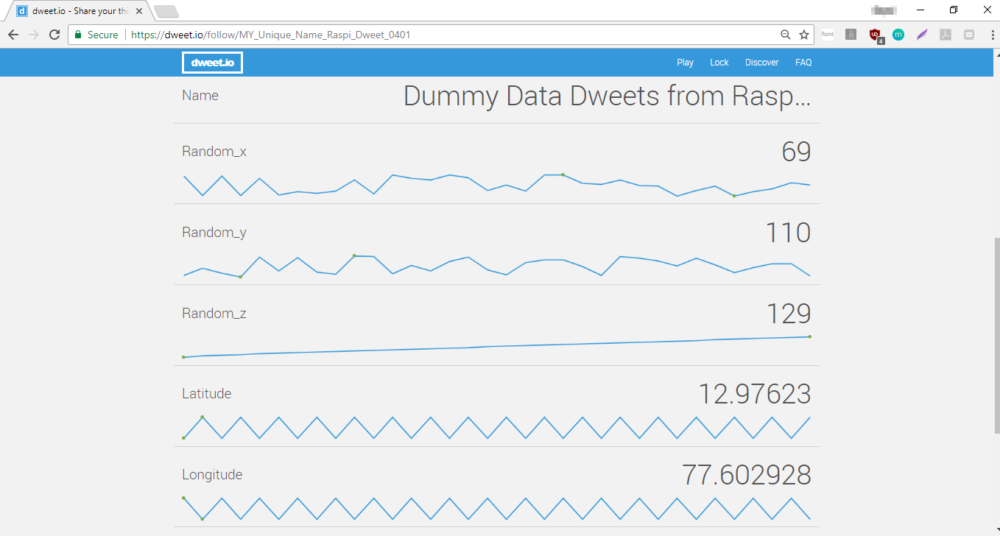

###### Step 4

With this basic visualization on dweet.io, you can create richer dashboards on freeboard.io.

First, make sure that you are logged in to [freeboard.io](http://freeboard.io) in another tab of your browser.

Next, click on the button 'Create a Custom Dashboard' from the dweet web page for your data.

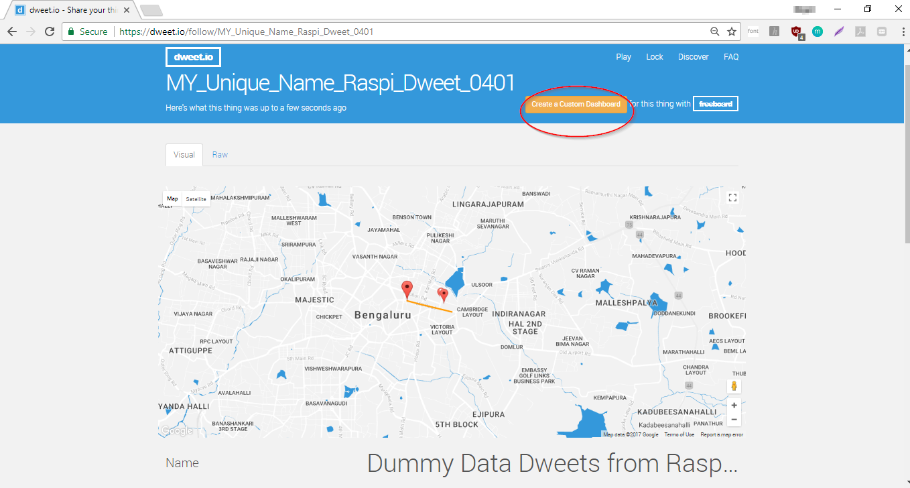

This should create a dashboard for you in another tab / window of your broswer.

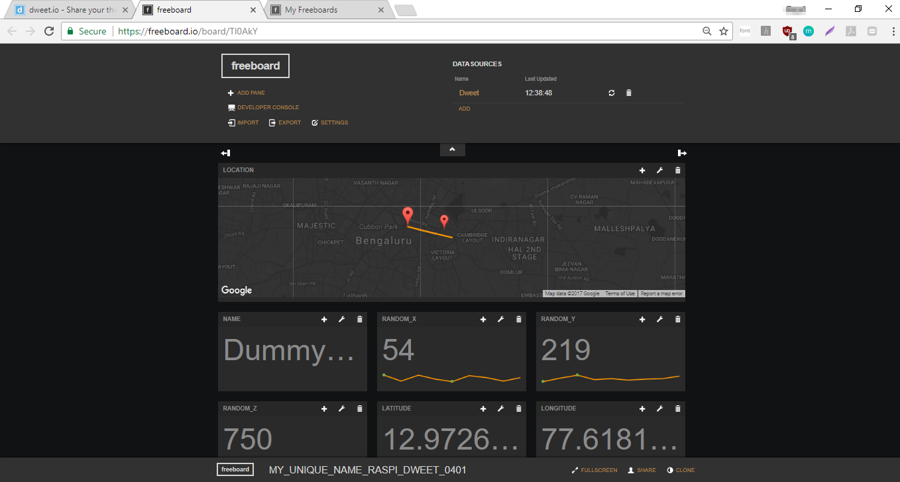

This is the basic dashboard which shows your data in a more graphical way. It can be customized as we will see below.

###### Step 5

Hover the mouse over any widget, for example the 'RANDOM_X' widget. You should see an icon to customize the widget. Click on that icon to customize the widget.


In the pop-up window click on the drop-down for the field 'TYPE' and then select 'Guage' from the list.

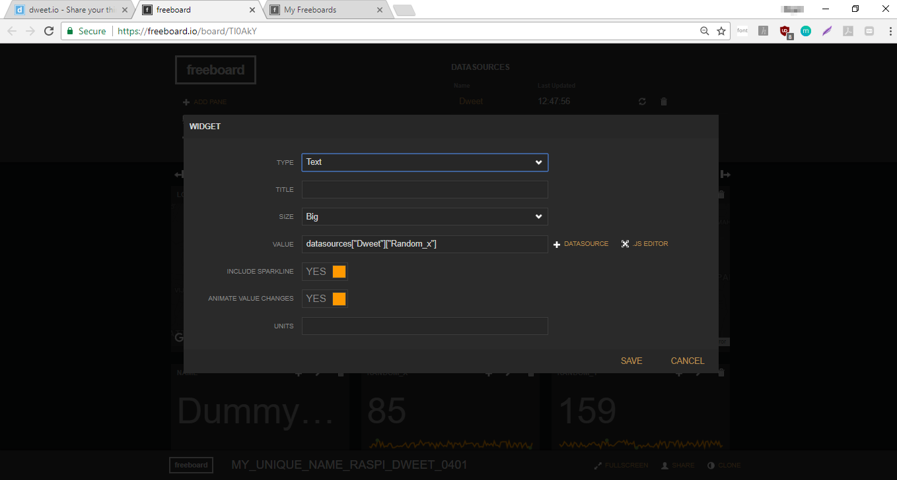


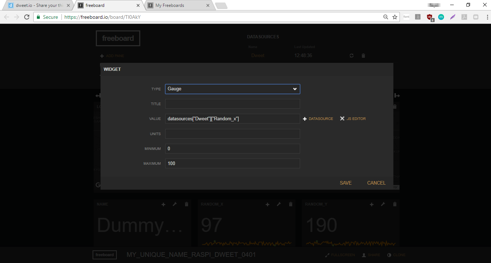

Leave other settings to default and click on 'SAVE'.
The widget should now change to a guage display.

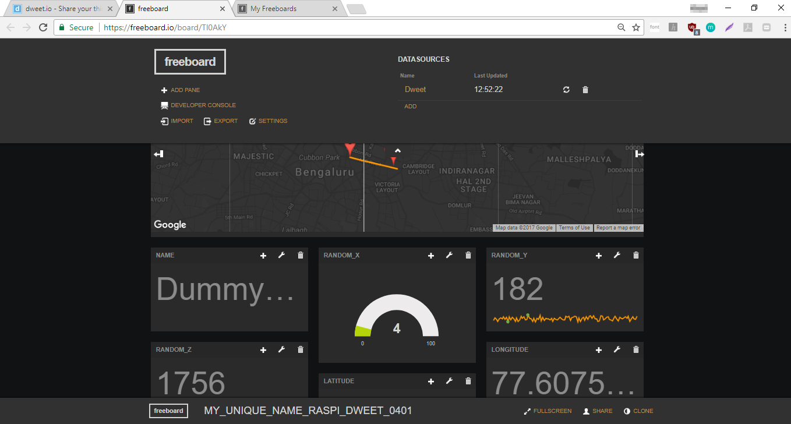

You can go on and customize other widgets, change the layout of the dashboard by dragging and dropping the widgets around.


###### Step 6

Additionally, you can configure the dashboard to a predefined layout. We will use a predefined layout is stored in file [dummy_dashboard.json](dummy_dashboard.json).

 Click on the 'IMPORT' button and in the 'Open file'. In the pop-up dialog for 'Open file', select the file 'dummy_dashboard.json' on your system.

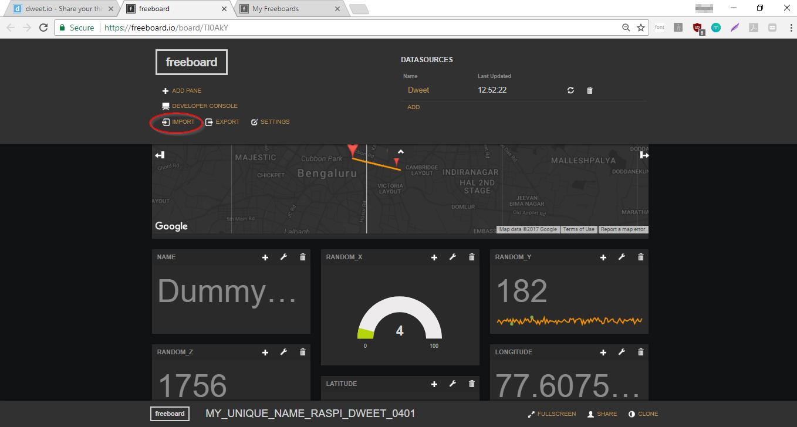


 This should change the layout of the dashboard to a different one as specified in the dummy_dashboard.json file.

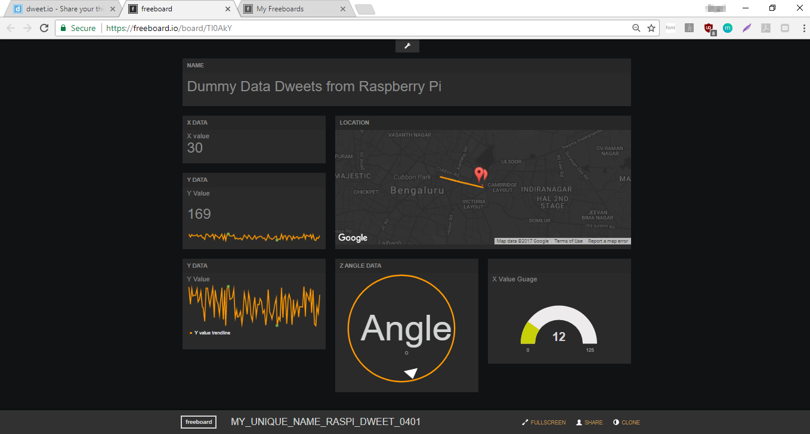

 You can also save your dashboard configuration by clicking on 'EXPORT' button.


###### Step 7

To dweet the data obtained from ultrasonic sensor distance measurement, the steps are similar to the earlier steps.

Open the file [send_sensors_dweet.py](send_sensors_dweet.py).

Add a unique name to the variable Dweet_Thing_Name on this line:
```
Dweet_Thing_Name = ""       # Use some unique name
```
Make sure to use a unique name, probably your full name or combination of name, age, date of birth etc.

The line should look something like this:

```
Dweet_Thing_Name = "My_Unique_Distance_data_753"
```

Note that the names are case sensitive.

Save the file.

###### Step 8

Execute the code now.

```
python send_dummy_dweet.py
```

This should output a message indicating the dweet was successful and also a URL. This URL is where you should be able to visualize your data.

```
Dweet successful. Please check https://dweet.io/follow/My_Unique_Distance_data_7531
```
###### Step 9

Now you can follow the steps 3 to 6 to visualize the data on dweet.io as well as create and customize the dashboards on freeboard.io.
