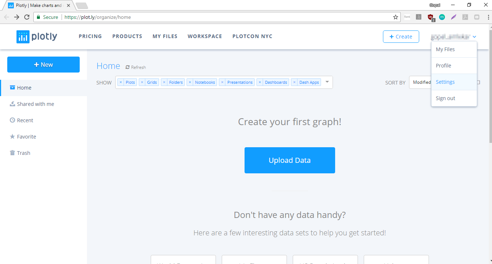
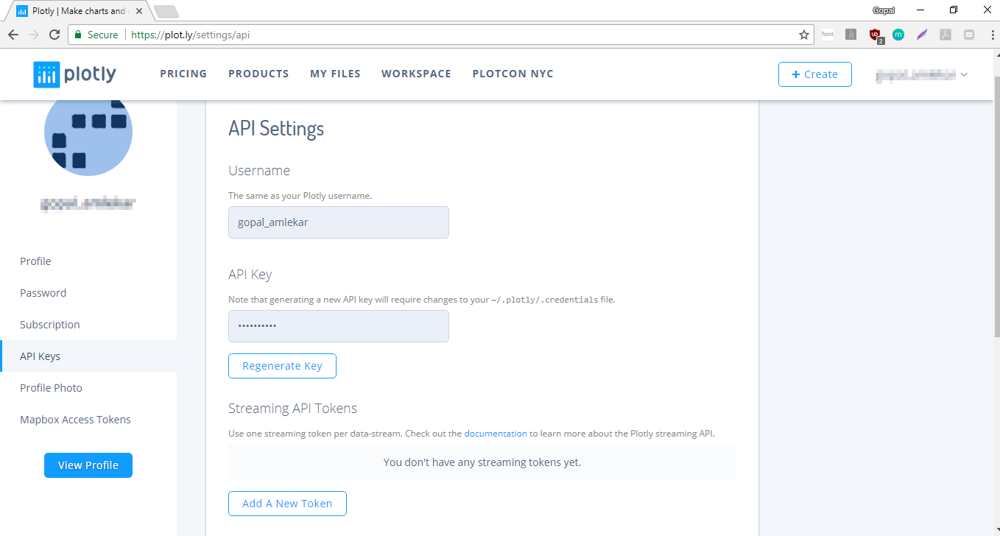
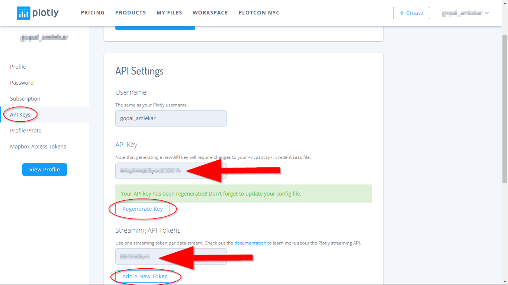

### Uploading Sensor data to Plotly

This repository folder contains sample code to send data to the [Plotly Website](https://plot.ly) and visualize the data in a chart on their website.

##### What is Plotly?

Plotly is a cloud based service that lets you easily create interactive charts and dashboards to share online with other users. The generated charts can not only be visualized but also exported to various formats such as png, pdf or other formats to create presentations, slides as well.


##### Steps

In this example, we will demonstrate usage of plotly by sending temperature data obtained from DHT11 sensor and visualize the data on plotly website. Follow the steps below.

###### ***Note***
Before going ahead, make sure that the DHT11 sensor is wired and working properly. You can test this by executing [dht11.py](../../devices/temperature_humidity_sensors/dht11.py) from the folder 'devices/temperature_humidity_sensors'

The DHT11 signal pin used in this code is GPIO 14, same as the one used in dht11.py code. Make sure to either use the same pin or change the code according to the pin you used.

###### Step 1

* Create an account on [Plotly](https://plot.ly/accounts/login/?action=login).
* Login to [Plotly](https://plot.ly/accounts/login/?action=login) with your credentials.


###### Step 2
* Click on the drop-down arrow besides your username and then click on 'Settings'.



We are going to need two things from the settings: API Key and a streaming token. These are required later to authenticate the data we send to plotly.



* From the left side bar, click on 'API keys'
* On the main page, click on 'Regenerate Key'. The API key will be regenerated.
* Similarly, click on 'Add a New Token'. This will generate a new token.  
* Copy the API key and the token in a text file on your Raspberry Pi. We will use them later.



###### Step 3

Switch back to the terminal window of your Raspberry Pi now.
Plotly provides a python package to make it easy to stream data to plotly. Install the package and dependencies:
```
sudo pip3 install plotly
sudo pip3 install plotly --upgrade
```

###### Step 4
Open the file [config.json](config.json) and put your plotly token, API key obtained in step 2 above. Also add your plotly user name.
Completed config.json file should look like this:
```
{
  "plotly_streaming_tokens": ["HKLphHiqElZyos2DRE1a"],
  "plotly_api_key": "89e4in08ga",
  "plotly_username": "ga_pi_plotly"
}
```

###### Step 5

Execute the code now.

```
python dht11_plotly.py
```

This should print the temperature measured and also a URL for your chart on plotly similar to the output shown below.
```.
Temperature: 29 degrees
View your streaming graph here: https://plot.ly/~ga_pi_plotly/0
```

###### Step 6

View your temperature data chart on the URL shown in your terminal. You should keep the code executing while the chart gets updated in real time. The temperature is measured and data uploaded to plotly every 10 seconds. You can change the interval for faster or slower measurement by changing the ```time.sleep(10)``` in main while loop to desired value.
