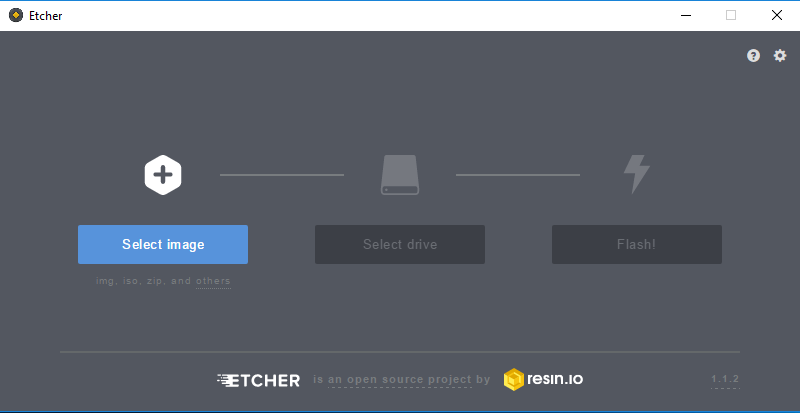

### Install Raspbian OS on SD card
###### Install Raspbian OS to SD card
***
Raspberry Pi is a Single board computer. Like any other computer, Raspberry Pi also needs an operating system to work with it.

The Operating system for Raspberry Pi needs to be installed on a SD card since it doesn't have a hard disk or SSD like the full fledged computers do.

The most popular operating system and the one officially supported and maintained by the Raspberry Pi foundation (the creators of Raspberry Pi) is Raspbian. Raspbian is based on Debian - a popular Linux distribution. It is customized for Raspberry Pi hardware and feature set.

In addition to Raspbian, there are other OS images available for Raspberry Pi as well such as Ubuntu, Windows 10 IoT Core etc. But Raspbian is the most popular one.

Here are the instructions to load the Raspbian OS on a SD card.

There are two ways to install Raspbian OS to SD card.

1. Using an automated installer NOOBS
2. Direct install Raspbian Image

##### NOOBS
NOOBS is an OS installer. It allows you to select the OS to be installed from a menu and then downloads that OS to install it.
NOOBS is a good way to install OS especially for those  completely new to Raspberry Pi eco-system. It is also useful in case you want to switch the installed OS.
However, One important thing to note is that installation using NOOBS requires a monitor and keyboard, mouse to be connected to the Pi.

In a nutshell, if you have a spare HDMI monitor, USB keyboard and mouse, then NOOBS may be easier and quicker way to go. If not, don't worry just scroll down to the next option.

Information about NOOBS is available [here](https://www.raspberrypi.org/documentation/installation/noobs.md).

##### Direct install Raspbian image without NOOBS

Installing Raspbian OS directly on the SD card without using NOOBS gives a major advantage that the Pi can be easily set up headless.
Headless setup of Pi implies that you can use your computer’s screen to connect to the Pi and control it. This way you don't need an additional HDMI monitor or a keyboard and mouse. You can use your computer's screen to remotely login to the Pi and work on it as if you were working on the monitor connected to Raspberry Pi itself. This is called headless setup. For this, we will install the Raspbian OS without the NOOBS installer.

1. Get SD card
First, you need to get a micro SD card to hold the Raspbian OS image. Minimum recommended size is 8GB. Buy genuinely good quality SD cards, not the cheap ones.
2. Get an Ethernet cable
You need an Ethernet cable to connect between your computer and the Raspberry Pi.
3. Download the OS
Download the latest Raspbian Image from this link:
[https://www.raspberrypi.org/downloads/raspbian/](https://www.raspberrypi.org/downloads/raspbian/)
Download the full image with desktop and not the "Light" version. The "Light" does not have a GUI by default but it is faster to boot and also smaller in size.

As of September 2017, the latest Raspian OS is called Raspbian Stretch. It was released in August 2017 and the earlier version was called Raspbian Jessie. On the Internet, you may find a number of references to Raspbian Jessie.
4. Download Etcher
While the download is in progress, go to [this](https://etcher.io) website and download Etcher tool for your computer's operating system. You can download either the setup file or the portable one. The portable one is useful when you don't have admin rights to install a program on your host system.

Etcher is an all-in-one tool to format the SD card and burn the the OS image to it. It is cross platform tool available for Windows, Linux and Mac with the same interface.

---

Once the OS image download is finished and etcher is installed (or the portable version is downloaded and ready to use), proceed to flash the OS image to SD card.

1. Start Etcher

2. Click on the 'Select Image' button in Etcher and select the Raspbian image file you just downloaded. It is not necessary to unzip the image file. Etcher does it for you.

3. Connect the SD card to your computer, either put the card in the SD card slot or you can connect it via a card reader. The SD card will appear as a removable drive on Windows. On Linux / Mac, you may need to mound the card.

4. Etcher automatically selects the SD card drive. However, if there are multiple SD cards connected, make sure that Etcher has selected the correct one. This is important because Etcher completely erases the data on the SD card.
Etcher by default does not select other drives, even the USB drives as well. There are settings to override this behaviour though.

5. Click on ‘Flash!’. It should take around 3 to 4 minutes to flash the image to SD card and verify it back.

6. Once finished, Etcher will automatically eject the card from system.

7. Remove the SD card from your computer. Raspbian is now ready on the SD card. If you want to go for a headless setup, read the details in [this](headless-setup.md) document.

TODO:
- [ ] Add detailed instructions for NOOBS installation
- [ ] Add Etcher instructions for Linux and Mac-OS
