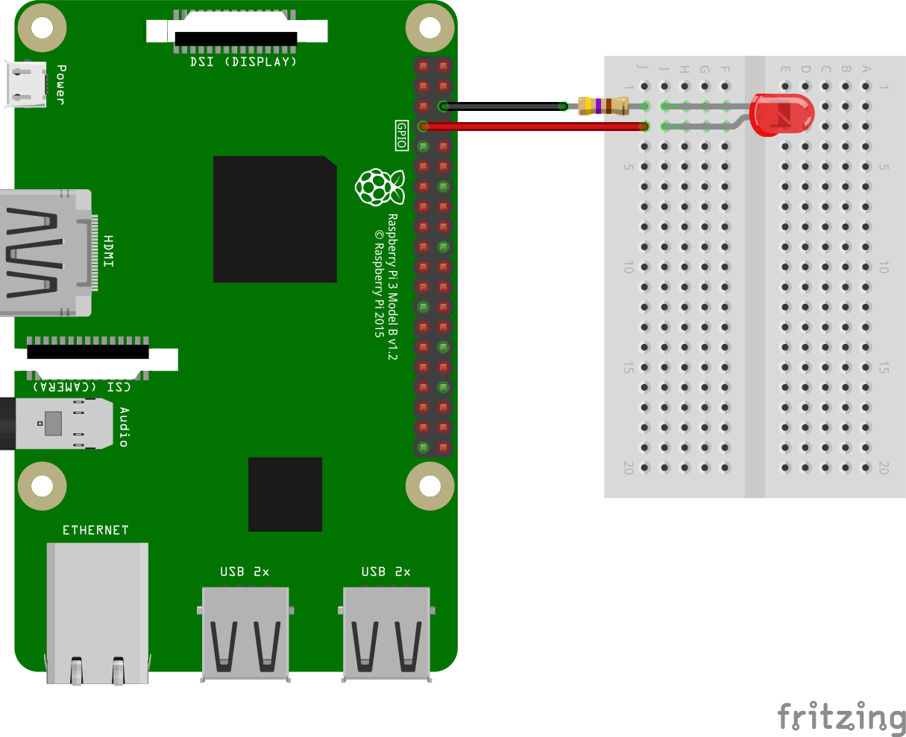

#### What is an LED?

LED stands for **L**ight **E**mitting **D**iode. An LED (In fact any Diode) has two terminals - Anode and Cathode. When sufficient current flows through the LED from the anode to cathode through the LED, it emits Light. This means that the anode should be connected to a positive voltage source and cathode to ground. The intensity of light is directly proportional to the current flowing through it.  

###### About LEDs

Most ubiquitous component found in any electronic product is an LED. They are also used in 7-segment displays, LED monitors, LED lights, decorative lamps and many other places. LEDs are available as single colour or multi colour LEDs.

* Single colour LEDs are most commonly available in Red, Green, Yellow colour as well as White and blue colour.

* Multi-colour LEDs are either Bi-colour or Tri-colour LEDs. These LEDs in fact have 2 or 3 LEDs internally and either the cathodes or anodes of these LEDs are wired together. Accordingly bi-colour LEDs usually have three terminals and tri-colour LEDs have four terminals. These LEDs can therefore be controlled individually or both together to emit a different colour.

* Bi-colour LEDs are also available in bi-directional configuration such that the internal diodes are connected in an anti-parallel configuration. Colour of light emitted depends on the direction of current.

* RGB LEDs are basically Tri-colour LEDs with Red, Green and Blue LEDs inside. When all the three LEDs are switched on, it emits white colour.

* 7-segment and matrix LED displays have LEDs inside connected in either a common-anode or common-cathode fashion.

#### Connecting LED to Raspberry Pi GPIO

There are essentially two ways to connect a single LED to the Raspberry Pi.

1. Connecting the anode to a GPIO pin and cathode to ground
In this case, switching the GPIO pin to high lights up the LED and switching it to low switches the LED off.

2. Connecting the cathode to a GPIO pin and anode to positive voltage (3.3V or 5V)
Exactly opposite to the first case, when the GPIO pin is switched to low, the LED lights up and switching the GPIO to high switches off the LED.

See the diagram below using the 1st configuration as described above.

In this case, the LED cathode is connected to ground via a 470 Ohms resistor. The anode is connected to GPIO 4 which is on board pin 7. The resistor is required to limit the amount of current flowing through the LED.

When the GPIO is switched to high, the voltage at anode becomes 3.3V with respect to the cathode and current flows from anode to cathode through the LED and resistor, thus switching on the LED.

When the GPIO is switched low, the voltage at anode becomes 0V with respect to cathode and hence no current flows through LED, effectively switching it off.

**How is value of the current limiting resistor calculated**
*Typically the operating current required for an LED is around 5mA. The voltage drop across LED is typically 1.2V. Now the total voltage across the circuit from GPIO 4 to ground is 3.3V when the LED is switched on. With 1.2V across the LED, the voltage drop across resistor becomes 3.3-1.2=1.1V. To maintain 5mA current, the resistor value is calculated by 1.1 / 5mA = 500 Ohms approximately. The closest available resistor value is 470 Ohms.*

*Strictly speaking, the current flow from anode to cathode is called conventional direction of current flow. The actual current flow (flow of electrons)always happens from cathode to anode.*

**Where can I get more information about LEDs**
*For more information about LEDs, it is best to refer datasheets and documentation by the manufacturers. Here are a few links for reference.*

[LITEON](http://optoelectronics.liteon.com/en-globalrd/Home/index)

[Kingbright](http://www.kingbrightusa.com)

[Sparkfun](https://www.sparkfun.com/categories/89)

[Vishay](http://www.vishay.com/leds/)
