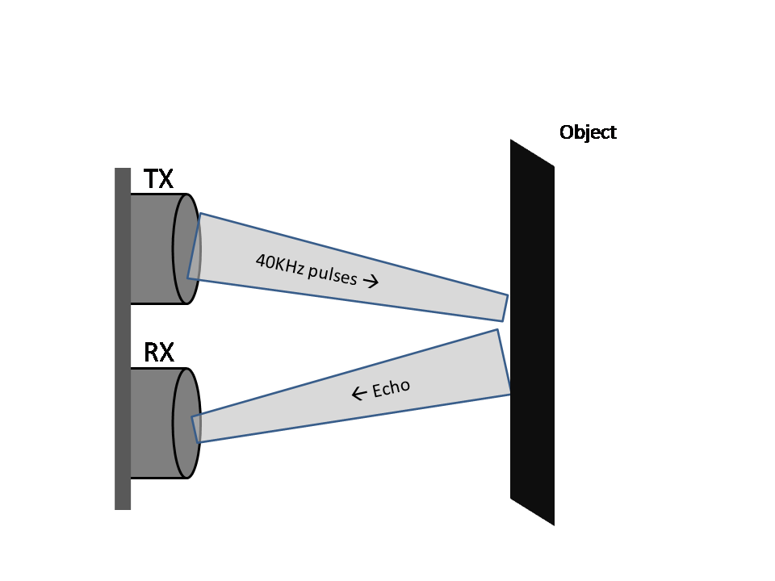
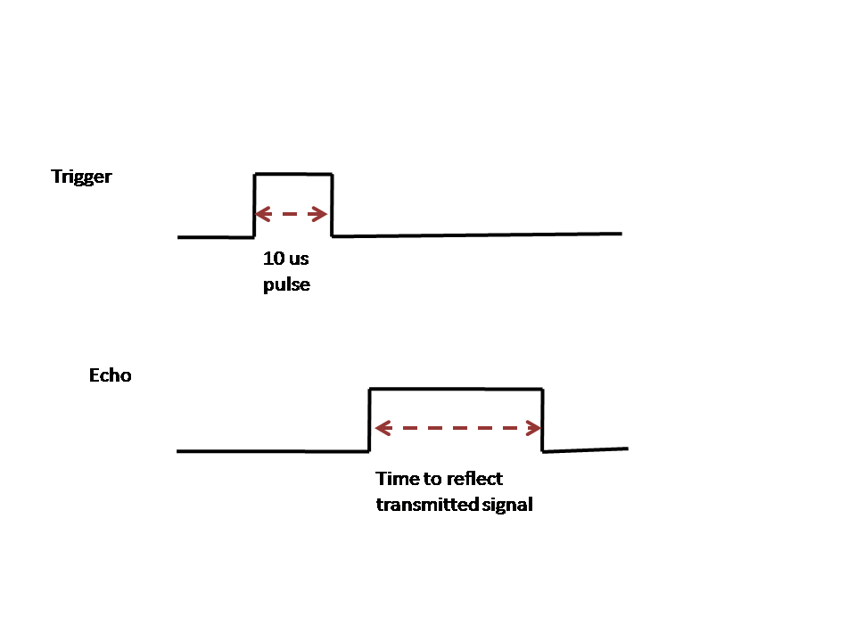

#### Ultrasonic Distance Measurement

Typically, an ultrasonic distance sensor has two components you can see here. One of them is a transmitter and the other one is a receiver. During distance measurement, the transmitter is activated to transmit bursts of 40KHz frequency which lies in the ultrasonic range. These waves reflect off any object in front of the sensor and are received by the receiver.

The time taken for the signal to echo back from an object depends on the distance of that object from the sensor. The sensor then outputs a pulse with the width of the pulse indicating the time required to transmit and receive the signal back. Using time and velocity formula, the distance can then be easily calculated in software.

The trigger signal starts transmission of ultrasonic signals and echo is the output from sensor indicating the time taken by signal to reflect back from the object.

#### Distance Calculations

Considering velocity of ultrasonic signals as 343m/sec, the following calculations can be used to arrive at the distance measured by the sensor. Note that the time indicated by the Echo pin pulse width is two way - Transmit and receive time.

Distance = velocity * (Time / 2)

Distance = 343 * (Time / 2)

Distance = 171.50 * Time

This gives the distance in meters as the velocity is meters per second. To calculate distance in cm, simply multiply by 100. The formula then gets simplified to:

Distance = 17150 * time

#### Interfaing HCSR04 to Raspberry Pi

HCSR04 has 4 pins, two of them being VCC and Ground. This sensor operates on 5V hence the VCC pin needs to be connected to 5V.

The Trigger pin of HCSR04 is an input pin from the sensor viewpoint. When this pin is supplied with a high-going pulse of 10 usec width, the sensor starts transmission of the ultrasonic signals. Although the sensor operates on 5V, the trigger pin can be activated with a 3.3V signal from the Raspberry Pi GPIO.

The Echo pin of HCSR04 is an output pin from the sensor viewpoint. Once the sensor receives the ultrasonic signal transmitted, it outputs a pulse on this Echo pin. Width of this pulse is indicative of the time required for the ultrasonic signal to travel from the sensor to the object and back to the sensor.

Here is the diagram for interfacing HCSR04 to Raspberry Pi.

In this case, the Trigger pin is connected to GPIO 2 and Echo pin to GPIO 3 on Raspberry Pi.

With the sensor working on 5V, the signal on Echo pin output by the sensor is a 5V pulse. Raspberry pi GPIO can handle only up to 3.3V signal and therefore connecting the Echo pin directly to the GPIO may damage the pins and even the pi itself. To shift down the 5V to 3.3V, a resistive divider is used. The resistor in series is a 1K Ohms and the one shunting the Raspberry Pi GPIO to ground is 2.2K Ohms.

**Where can I get more information about HCSR04**

*For more information, you can go through the documents referenced below*

[Datasheet](https://cdn.sparkfun.com/datasheets/Sensors/Proximity/HCSR04.pdf)

[User Guide](https://elecfreaks.com/estore/download/EF03085-HC-SR04_Ultrasonic_Module_User_Guide.pdf)
