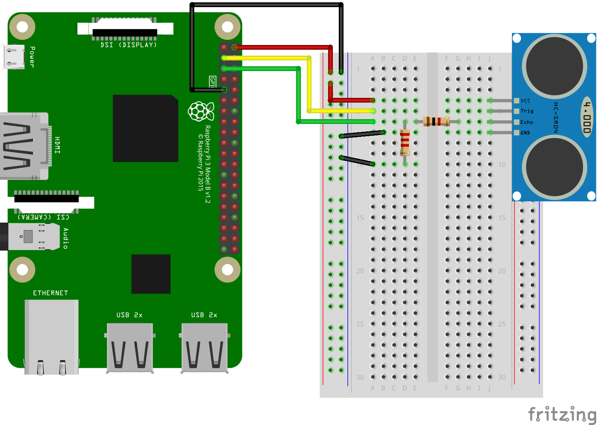

### Distance measurement using ultrasonic distance sensor with Raspberry Pi

Using ultrasonic signals to sense distance to an object is the simplest way to measure distance. The most commonly used sensor for this purpose is HC-SR04.

Below are the quick steps to get the sensor up and running on Raspberry Pi.

#### Hardware

Wire up the circuit as shown below.

1. Connect the VCC pin of HCSR04 to 5V (Raspberry Pi board pin 2 or 4).

2. Connect ground pin of HCSR04 to Ground.

3. Connect the *Trigger* pin of HCSR04 to a GPIO 2 (Board pin number 3).

4. Connect the *Echo* pin of HCSR04 to a GPIO 3 (Board pin number 5) via a resistor (1K Ohms).

5. Also connect a resistor (2.2K Ohms) from GPIO 3 of Raspberry Pi to Ground.

These two resistors - 1K and 2.2K Ohms - form a resistive voltage divider to protect the Raspberry Pi GPIO.




#### Software

We will use the RPi.GPIO library for manipulating the GPIO pins.

From Raspberry Pi viewpoint, GPIO 2 (HCSR04 Trigger) becomes an output pin and GPIO 3 (HCSR04 Echo) becomes an input pin. To measure distance, the trigger pin needs a pulse of 10usec. After distance measurement is complete, the Echo pin outputs a pulse of width corresponding to the distance.

The file below contains the code to interface HCSR04 sensor.
[hcsr04.py](hcsr04.py)

To run the code:
```
_> python hcsr04.py
_> Distance Measurement In Progress
_> Using BCM Mode, Trigger on GPIO 2 and  Echo on GPIO 3
_> Waiting For Sensor To Settle
_> Distance: 15.24 cm
```

This will print a couple of messages followed by the distance measured by the sensor.

###### Notes

* Distance measurement using this sensor works the best when the object has a flat surface. Since the ultrasonic signal travels in a beam like pattern, if the object is having irregular shape, only part of the signal may get reflected affecting accuracy of the measurement.

* The resistive voltage divider for connecting Echo pin to Raspberry Pi GPIO is critical to use. The sensor operates on 5V and hence outputs a 5V signal. However, the GPIO pins of Raspberry Pi are only 3.3V tolerant. The resistors drop the 5V signal from Echo pin to approximately 3.3V and therefore protects the GPIO pins of Pi.

* For additional information about ultrasonic distance measurement and HC-SR04, have a look at this file [HCSR04-Info.md](HCSR04-Info.md).
