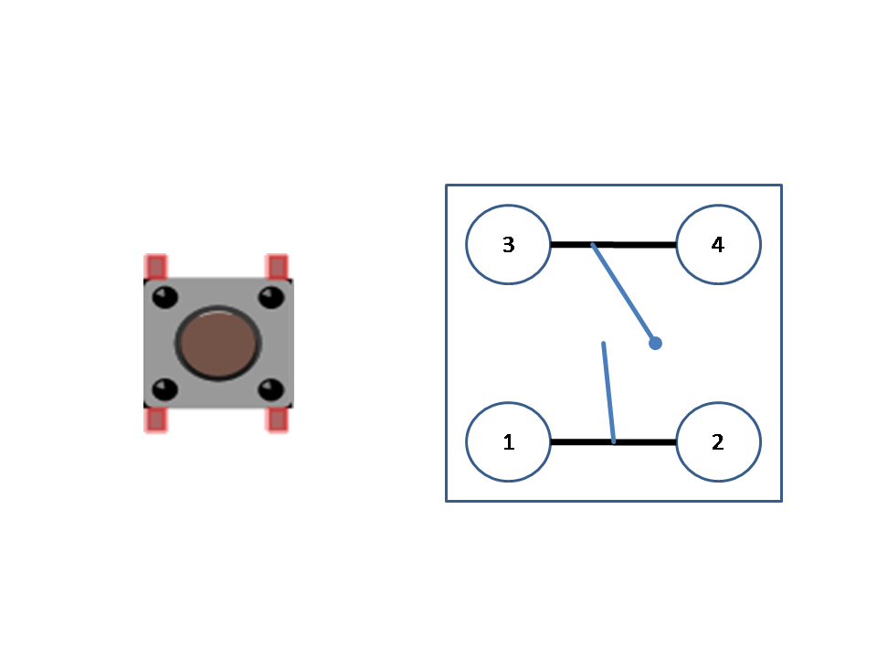
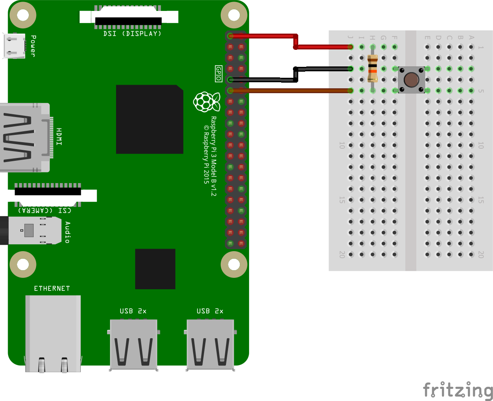

### Interfacing a Push Button Raspberry Pi GPIO

#### Push Button

A push-button is ubiquitous component found in almost all electronic gadgets. It is a mechanical component with a spring like mechanism inside to connect or disconnect the button pins. It does not retain its state after it has been released.

GPIO pins of Raspberry Pi can act as input pins as well making it possible to detect a button press.

Pushbutton comes with either two pins or four pins with the latter being more common.



In this push button, Pins 1 and 2 on the button, which are the bottom two pins are internally shorted to each other. Similarly pins 3 and 4 in the upper part of the switch here, are shorted to each other internally. So in effect we can use either pin from the pairs of pins to connect.

When the switch is pressed, all these pins get connected to each other Since this is a push to on button the connection between these pins stays as long as the button is pushed. When the switch is released, pins 1 and 3 and also pins 2 and 4 get disconnected.

#### Hardware

Wire up the circuit as shown below.



Connect either pin 1 or 2 of the switch to GPIO 17 (Board pin number 11).

Connect either pin 3 or 4 to ground.

Also connect a 10K Ohms resistor from the GPIO 17 to 3.3V. This acts as a pull-up resistor.

When the switch is not pressed, the GPIO 17 is at 3.3V because of this connection to 3.3V via this resistor. The 10K Ohm resistor ensures that the 3.3V and ground do not get shorted to each other.

However, when the switch is pressed, the GPIO gets connected to ground via the switch.


#### Software

In the Python code, we detect this change in the pin’s voltage and thus detect whether the switch is pressed or not.

Full code is available in [button.py](button.py). To run the code, simply execute the python command from terminal.

```
python button.py
```

This will print the initial state of the switch either pressed or released and then it will monitor the switch forever until the code execution is terminated with Control + C. Every time you press the switch or release it, the code will print the button state on terminal.

```
Button is Pressed
Button is Released
[...]
Button is Pressed
```
