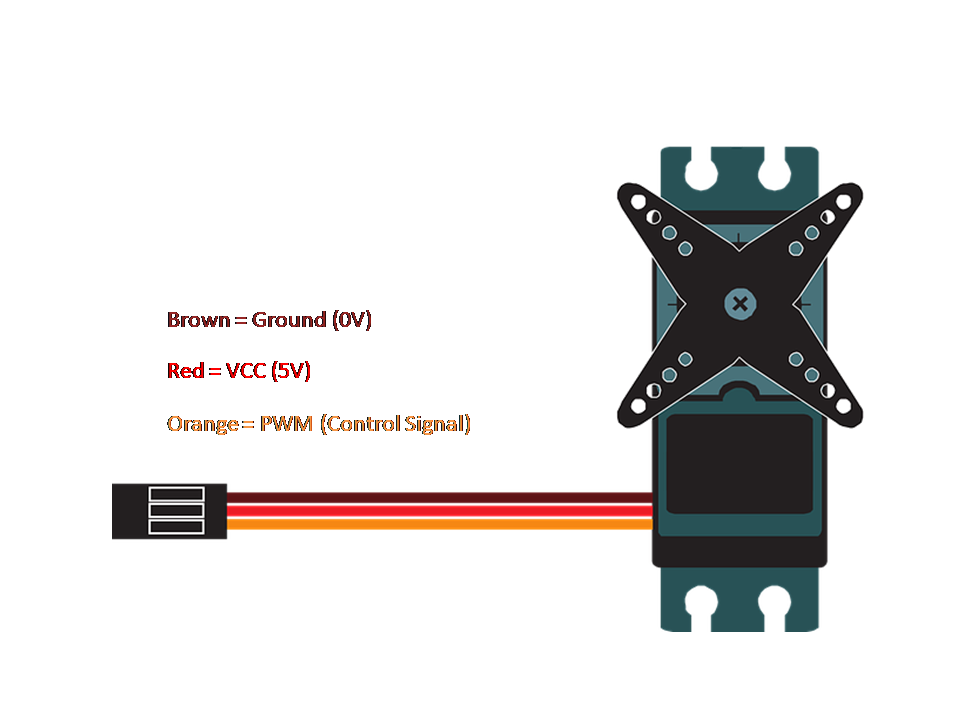

### Interfacing Servo Motor with Raspberry Pi

Servo motor is a commonly used actuator device especially for robotics applications or any device where precise movement is needed.

Here is a quick guide to control a servo motor from Raspberry Pi.

#### Hardware

Servo motor needs a 5V power supply and can be powered up directly from the Raspberry Pi itself. However, it is advisable to use an external power adapter for the servo.

Typically the connections of servo motor are as below. However, please verify the connections for your servo motor with datasheet from the manufacturer.

Wire up the circuit as shown below. This circuit shows the motor powered from Raspberry Pi.

Connect the Orange wire to GPIO 23 (Board pin 16) through a 1K resistor. This resistor keeps the servo motor circuitry isolated from the Raspberry Pi so as to provide a basic protection to the GPIO pins.

Connect the Red wire to +5V and Brown wire to Ground on Raspberry Pi GPIO.

If you are using an external power adapter for the motor, please make sure that all the ground connections are connected together. That means, the ground of servo motor, Raspberry Pi and the power adapter should all be connected together.

Generating a PWM signal on the GPIO pin from the software makes the motor rotate by an angle between 0 to 180 degrees.

#### Software

The library RPi.GPIO provides a useful method to generate PWM signal on a GPIO pin.

The sample program [servo-basic.py](servo-basic.py) demonstrates the servo motor working and interfacing with Raspberry Pi. This program gets the user input for the angle of rotation and rotates the motor by generating PWM with the pulse width required for that rotation.

###### Notes

 For operating principle and other information about Servo motor, have a look at this file [LED-Info.md](Servo-Info.md).
