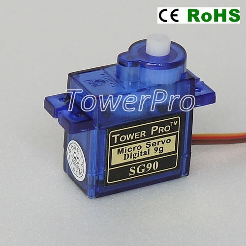
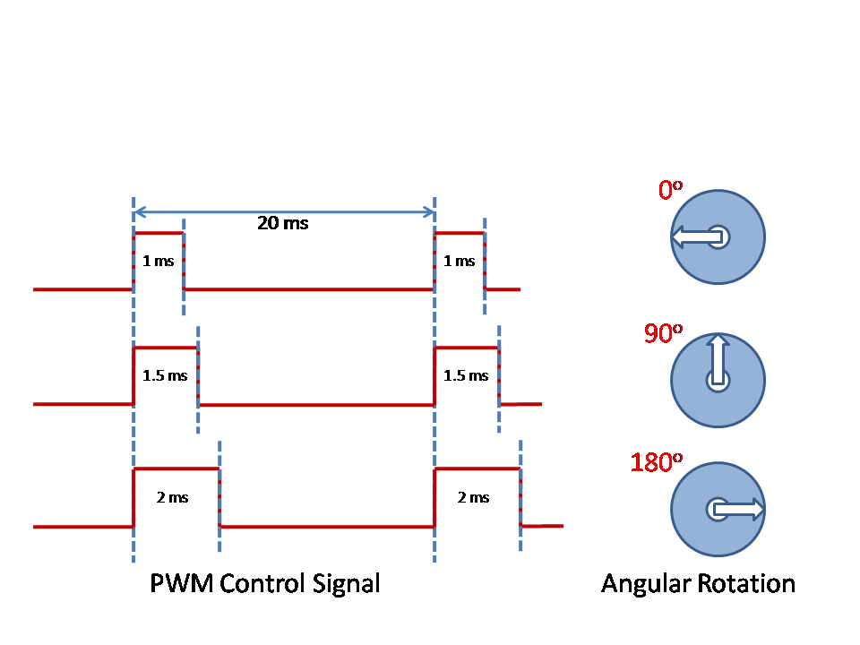

#### How does a servo motor work?

A servo motor is an electromechanical device to rotate an object by some specified angle in a very precise way. It has in-built feedback mechanism to ensure precise angular movement.

A servo motor is controlled by a Pulse Width Modulated signal or PWM in short. The PWM signal has a fixed frequency but the ON period of the signal can be varied. This ON period directly controls the position of the servo motor.

As seen here, a typical servo motor expects the PWM signal every 20 msec and the ON period of the signal determines the position of the servo. So as you can see in the first example here, when the ON period is 1 msec, the servo is at 0 degree position. When the ON period is 1.5 msec, the servo moves by 90 degrees and finally when the ON period is 2 msec, the servo moves 180 degrees. This 0 to 180 degree rotation is sometimes also referred to as -90 to +90 degree rotation.

Note that in all cases, the total time duration of the signal remains same as 20 msec as this is the typical refresh rate for control signal for the servo motor. In software, to get a variable ON period keeping the frequency constant, PWM is the best method to use. As the name implies, it modifies the Pulse width and keeps the total period constant.

Once the PWM is supplied, the servo retains the position. If the PWM signal is removed the servo can still retain the position but an external force will be able to move the motor shaft.
In presence of the PWM signal, it will keep the shaft aligned at the particular angle so an external force will not be able to move the shaft easily.

###### Notes

* The pulse widths of 1msec to 2msec provided above are typical values for a model RC servo motor. These are not very accurate and may vary for your motor. It is best you observe the motor to calculate the width required for 0 degrees and 180 degrees and then use them.

* Typical servo motors can rotate only up to 180 degrees but there are servo motors available with full 360 degree rotation.

* Here are a few links for reference.

[Datasheet](http://www.micropik.com/PDF/SG90Servo.pdf)

[TowerPro Website](http://www.towerpro.com.tw/)
