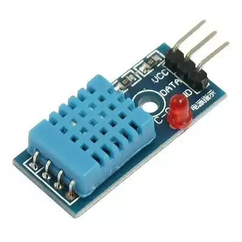
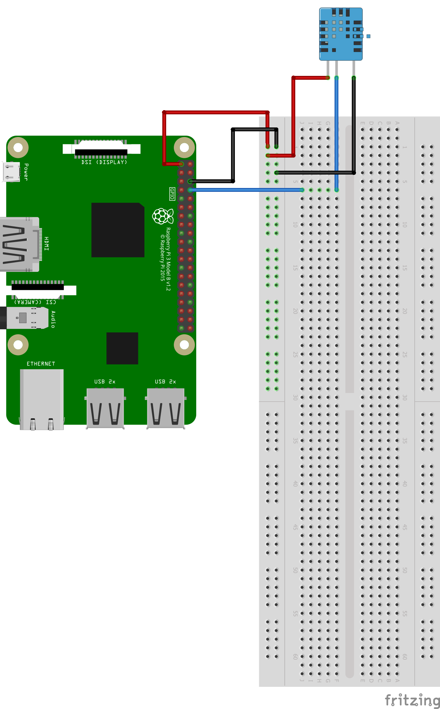

### Interfacing DHT11 Temperature and humidity Sensor with Raspberry Pi

This module integrates DHT11 sensor and other required components on a small PCB. The DHT11 sensor includes a resistive-type humidity measurement component, an NTC temperature measurement component and a high-performance 8-bit microcontroller inside, and provides calibrated digital signal output. It has high reliability and excellent long-term stability.

The image shown above is a breakout board for DHT11. This means that the board contains a DHT11 sensor and few additional components such as resistors, LEDs as required.  The sensor itself is a 4-pin sensor (VCC, DATA, GND and an unused pin). The unused is not brought out on the breakout board header so the module becomes a 3-pin module.

#### Hardware

Wire up the circuit as shown below. This circuit shows the sensor with the NC (Not connected) pin removed so only the VCC, DATA and Ground pins are seen.

1. Connect the VCC to 3.3V.
2. Connect the Data pin to GPIO 14 directly. No resistors are required.
3. Connect ground pin to ground on Raspberry Pi GPIO header.

Note that some of the modules may use slightly different naming conventions for the pins on DHT11 module such as:

VCC -> VDD or only a symbol '+'
GND -> Symbol '-'
DATA -> Just a letter 'S' indicating Signal pin.

#### Software

The program to interface to DHT11 is slightly complex compared to the simple LED, button or even the hcsr04 interfacing programs.

After powering on DHT11, the GPIO is first set as an output pin and a low-going pulse of about 20msec is sent on the pin. This causes the sensor to start measurement of temperature and humidity.

After the pulse, the GPIO pin is then set as an input to start listening to the data sent by the sensor.

When the measurement is complete, DHT11 sends pulls the data  pin low and then high for about 80 usec each. This is a signal to indicate start of data transfer. The data sent by DHT11 is a 40-bit data which is then parsed to extract humidity and temperature. The data format is as below.

Higher byte of humidity data -> 8 bits
Lower byte of humidity data -> 8 bits
Higher byte of temperature data -> 8 bits
Lower byte of temperature data -> 8 bits
Parity -> 8 bits
(Parity is like a checksum which is the sum of all the 4 bytes of data sent earlier.)

The code to interface and read the temperature, humidity from DHT11 is in the file [dht11.py](dht11.py).

###### Notes

 For additional information about DHT11, have a look at the  [datasheet](https://akizukidenshi.com/download/ds/aosong/DHT11.pdf).
